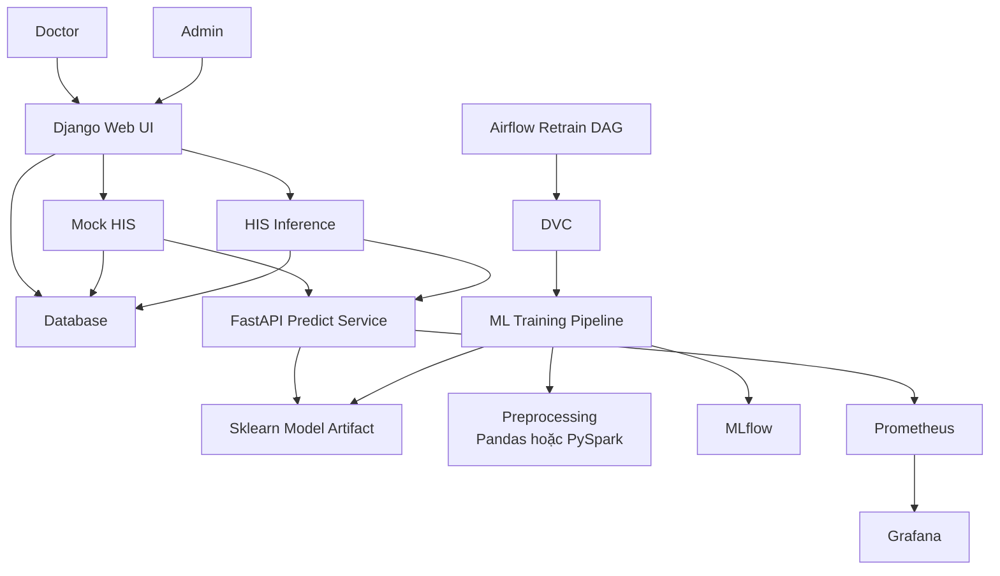
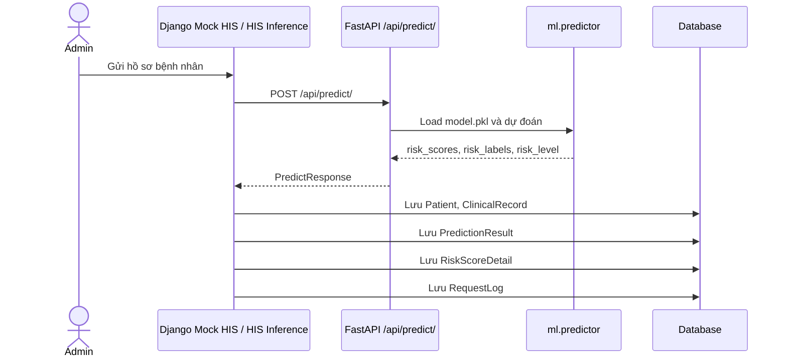
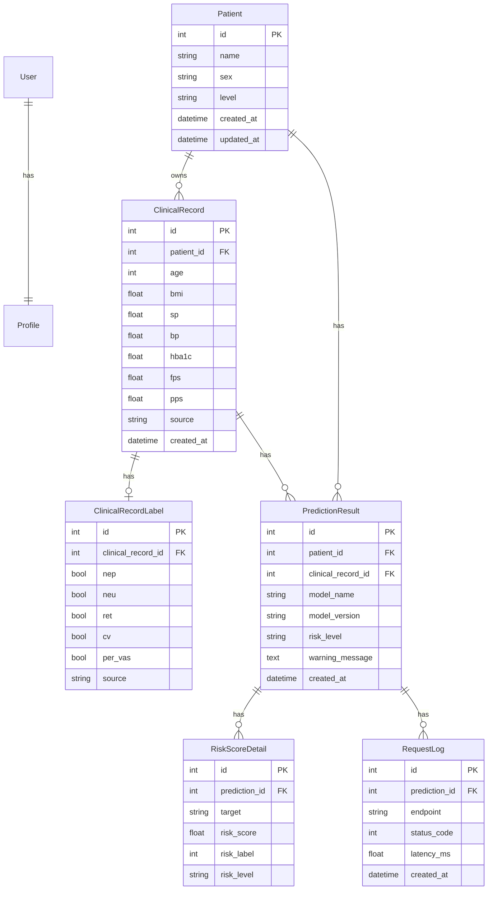
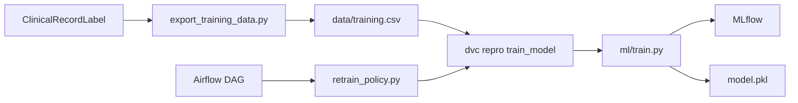

# PHÂN TÍCH - THIẾT KẾ HỆ THỐNG

## 1. Tổng quan

Hệ thống `diabetes_predict_system` là một hệ thống hỗ trợ quyết định lâm sàng cho bài toán dự đoán nguy cơ biến chứng tiểu đường. Hệ thống nhận hồ sơ lâm sàng từ Mock HIS hoặc luồng HIS Inference, gọi FastAPI để dự đoán 5 nhóm biến chứng, lưu kết quả vào database và hiển thị cho bác sĩ hoặc quản trị viên theo dõi.

Hệ thống không thay thế chẩn đoán y khoa. Kết quả dự đoán được dùng như tín hiệu hỗ trợ sàng lọc, ưu tiên hồ sơ và giám sát vận hành mô hình.

Các biến chứng đang dự đoán:

| Mã | Ý nghĩa |
| --- | --- |
| `NEP` | Nephropathy - biến chứng thận |
| `NEU` | Neuropathy - biến chứng thần kinh |
| `RET` | Retinopathy - biến chứng võng mạc |
| `CV` | Cardiovascular - biến chứng tim mạch |
| `PER VAS` | Peripheral vascular - biến chứng mạch ngoại biên |

## 2. Phạm vi hệ thống

| Nhóm chức năng | Trạng thái trong hệ thống | Căn cứ chính |
| --- | --- | --- |
| Đăng nhập, phân quyền | Đã có | `accounts/models.py`, `accounts/permissions.py` |
| Dashboard tổng quan | Đã có | `dashboard/views.py`, `dashboard/templates/dashboard/dashboard.html` |
| Quản lý bệnh nhân, hồ sơ lâm sàng | Đã có | `patients/models.py`, `patients/views.py` |
| Mock HIS và HIS Inference | Đã có | `mock_his/views.py`, `mock_his/feed_runner.py` |
| API dự đoán | Đã có | `api/main.py`, `ml/predictor.py` |
| Lưu kết quả dự đoán | Đã có | `predictions/models.py`, `mock_his/views.py` |
| Cảnh báo nguy cơ | Đã có ở mức suy diễn từ kết quả dự đoán | `alerts/views.py` |
| Lịch sử dự đoán | Đã có | `history/views.py` |
| Huấn luyện, tuning, MLflow | Đã có | `ml/train.py`, `ml/tune.py`, `ml/registry.py` |
| DVC pipeline | Đã có | `dvc.yaml` |
| Airflow retrain | Đã có | `airflow/dags/retrain_diabetes_model.py` |
| Monitoring | Đã có | `api/metrics.py`, `monitor/views.py`, `monitoring/` |
| Docker local | Đã có | `Dockerfile`, `docker-compose.yml` |
| Docker Hub runtime | Đã có | `docker-hub/docker-compose.yml`, `docker-hub/DOCKER-HUB.md` |

## 3. Vai trò người dùng

| Vai trò | Quyền chính |
| --- | --- |
| Doctor | Xem dashboard, danh sách bệnh nhân, cảnh báo, lịch sử dự đoán. |
| Admin | Có quyền của Doctor và thêm quyền vận hành Mock HIS, HIS Inference, Modeling, Monitor, Logging, MLflow, Airflow, Grafana. |

Phân quyền được xác định bởi `Profile.Role.DOCTOR`, `Profile.Role.ADMIN` và các decorator trong `accounts/permissions.py`.

## 4. Kiến trúc tổng thể



### Ghi chú kiến trúc

- Django là lớp giao diện, phân quyền và lưu dữ liệu nghiệp vụ.
- FastAPI chỉ phục vụ dự đoán, health check và metrics; FastAPI không tự lưu database.
- Django gọi FastAPI trong `mock_his/views.py`, sau đó lưu `Patient`, `ClinicalRecord`, `PredictionResult`, `RiskScoreDetail`, `RequestLog`.
- Pipeline huấn luyện dùng scikit-learn, có Optuna tuning, MLflow tracking/registry và DVC orchestration.
- Tiền xử lý dữ liệu huấn luyện hiện hỗ trợ 2 backend: `pandas` và `pyspark`.
- Monitoring gồm Prometheus lấy `/metrics` từ FastAPI và Grafana đọc Prometheus.

## 5. Luồng dự đoán



Đầu vào dự đoán gồm 15 feature:

| Nhóm | Feature |
| --- | --- |
| Thông tin nền | `AGE`, `SEX`, `BMI` |
| Chỉ số lâm sàng | `SP`, `BP`, `HbA1c`, `FPS`, `PPS` |
| Tiền sử và hành vi | `FAMILY H/O`, `ONSET AGE`, `DIA LIFE`, `SMOKING`, `PHY ACT`, `MED USE`, `MED ADH` |

Đầu ra gồm:

- `risk_scores`: xác suất/rủi ro theo từng biến chứng.
- `risk_labels`: nhãn 0/1 theo từng biến chứng.
- `risk_level`: mức tổng hợp `low`, `medium`, `high`.
- `warning_message`: cảnh báo hiển thị cho người dùng.
- `model_name`, `model_version`: thông tin model phục vụ truy vết.

## 6. Thiết kế dữ liệu



### Ghi chú dữ liệu

- `Patient` lưu thông tin hồ sơ chính và mức rủi ro tổng hợp mới nhất.
- `ClinicalRecord` lưu từng lần nhận dữ liệu lâm sàng.
- `ClinicalRecordLabel` là ground truth dùng cho retrain, không phải kết quả dự đoán.
- `PredictionResult` lưu metadata mỗi lần dự đoán.
- `RiskScoreDetail` lưu chi tiết điểm rủi ro cho từng target.
- `RequestLog` lưu endpoint, status code và latency của lần gọi dự đoán.
- Cảnh báo hiện chưa có bảng `Alert` riêng; trang Alerts suy ra từ `RiskScoreDetail.risk_label = 1`.

## 7. Thiết kế ML và MLOps

### Huấn luyện model

Pipeline huấn luyện trong `ml/train.py` gồm các bước:

1. Đọc cấu hình từ `configs/model_training_config.json`.
2. Đọc và làm sạch dữ liệu bằng `ml/preprocessing.py`.
3. Tách feature/target.
4. Tạo pipeline tiền xử lý bằng `ColumnTransformer`.
5. Huấn luyện các model được bật trong cấu hình.
6. Tùy chọn tuning bằng Optuna.
7. Đánh giá bằng `f1_macro`, `f1_micro`, `recall_macro`, `hamming_loss`, `label_acc`, `exact_acc`.
8. Ghi log MLflow.
9. So sánh với champion model nếu bật registry.
10. Lưu model được promote vào `ml/artifacts/model.pkl`.

### Model hiện hỗ trợ

| Model | Trạng thái |
| --- | --- |
| Logistic Regression | Đang bật trong config |
| Random Forest | Đang bật trong config |
| XGBoost | Có search space, chỉ dùng nếu package import được và model được bật |

### Tiền xử lý dữ liệu

`ml/preprocessing.py` hỗ trợ:

| Backend | Mục đích |
| --- | --- |
| `pandas` | Phù hợp dữ liệu nhỏ, chạy đơn giản. |
| `pyspark` hoặc `spark` | Phù hợp dữ liệu lớn hơn, dùng Spark để đọc/làm sạch CSV trước khi chuyển về pandas cho scikit-learn. |

Cấu hình hiện tại trong `configs/model_training_config.json` đang đặt:

```json
"preprocessing_backend": "pyspark"
```

Lưu ý: phần model vẫn là scikit-learn nên vẫn huấn luyện trên CPU. PySpark chỉ được dùng cho phần đọc và xử lý dữ liệu trước huấn luyện.

### Điểm lệch cần lưu ý

`ModelTrainingConfig` trong `modeling/models.py` hiện chưa có field `preprocessing_backend` và `as_config()` chưa ghi key này. Vì vậy nếu chỉnh cấu hình training qua Django admin, file `configs/model_training_config.json` có thể bị ghi lại mà mất `preprocessing_backend`. Đây là điểm lệch tài liệu cần ghi nhận, không sửa trong phạm vi tài liệu này.

## 8. Retrain



Luồng retrain gồm:

- `ClinicalRecordLabel` cung cấp nhãn thật.
- `ml/export_training_data.py` xuất dữ liệu training.
- `ml/retrain_policy.py` kiểm tra điều kiện retrain như số nhãn mới, tỷ lệ nhãn mới, số ngày tối thiểu, missing rate, duplicate rate.
- `dvc.yaml` định nghĩa stage `export_training_data` và `train_model`.
- `airflow/dags/retrain_diabetes_model.py` điều phối retrain theo lịch.
- `ml/train.py` huấn luyện, log MLflow, promote hoặc giữ champion model.

## 9. Monitoring và logging

| Thành phần | Vai trò |
| --- | --- |
| FastAPI `/metrics` | Xuất Prometheus metrics. |
| Prometheus | Thu thập metrics từ FastAPI. |
| Grafana | Hiển thị dashboard vận hành. |
| Django Monitor | Tổng hợp thông tin từ database và service health. |
| `RequestLog` | Ghi latency, endpoint và status code của request dự đoán. |

Monitoring hiện tập trung vào vận hành API, số lượng request, latency và trạng thái service. Các chỉ số chất lượng model sau huấn luyện được log qua MLflow.

## 10. Thiết kế giao diện

Giao diện Django dùng:

- Tailwind CDN và CSS nội bộ trong `static/css/style.css`.
- Material Symbols cho icon.
- Anime.js trong `static/js/animations.js` để tạo chuyển động khi load trang, card, bảng và sidebar.
- Three.js trong `static/js/three-scene.js` để tạo nền 3D cho dashboard.

Dashboard hiện có root element:

```html
data-three-scene="clinical-network"
```

Three.js tạo canvas nền dạng mạng lâm sàng, nằm sau nội dung dashboard. Anime.js xử lý animation UI, đồng thời có logic giảm delay chuyển trang khi click điều hướng nội bộ.

## 11. Triển khai

### Docker local

Stack local chính nằm ở `docker-compose.yml`:

| Service | Cổng | Vai trò |
| --- | --- | --- |
| `django` | `8000` | Web UI, database workflow, admin. |
| `api` | `8001` | FastAPI prediction service. |
| `mlflow` | `5000` | MLflow UI/tracking. |
| `prometheus` | `9090` | Metrics collection. |
| `grafana` | `3000` | Dashboard monitoring. |

Image local được build từ `Dockerfile`. Dockerfile đã dùng `openjdk-21-jre-headless` và thiết lập `JAVA_HOME`, `PYSPARK_PYTHON`, `PYSPARK_DRIVER_PYTHON` để hỗ trợ PySpark.

### Docker Hub

Thư mục `docker-hub/` dành cho người dùng kéo image đã push từ Docker Hub về chạy, không cần build source local.

Các file chính:

| File | Vai trò |
| --- | --- |
| `docker-hub/docker-compose.yml` | Compose dùng image `${APP_IMAGE}` hoặc `nguyenminh079/diabetes-predict-system:latest`. |
| `docker-hub/.env.example` | Mẫu biến môi trường. |
| `docker-hub/prometheus.yml` | Cấu hình Prometheus khi chạy từ Docker Hub package. |
| `docker-hub/DOCKER-HUB.md` | Hướng dẫn kéo image và chạy hệ thống. |

Airflow hiện là stack riêng trong thư mục `airflow/`, không nằm trong package Docker Hub runtime chính.

## 12. Use case chính

### Doctor

| Use case | Mô tả |
| --- | --- |
| Xem dashboard | Theo dõi tổng quan bệnh nhân, hồ sơ xử lý, cảnh báo rủi ro, số dự đoán. |
| Xem bệnh nhân | Xem danh sách và chi tiết hồ sơ bệnh nhân. |
| Xem cảnh báo | Xem các biến chứng có `risk_label = 1`. |
| Xem lịch sử | Xem lịch sử dự đoán và log liên quan. |

### Admin

| Use case | Mô tả |
| --- | --- |
| Vận hành Mock HIS | Gửi hồ sơ mẫu có ground truth tới FastAPI và lưu kết quả. |
| Vận hành HIS Inference | Gửi hồ sơ không nhãn để tạo dự đoán. |
| Theo dõi model | Xem trạng thái model, config training, package cần thiết. |
| Theo dõi monitor/logging | Kiểm tra service, metrics và request log. |
| Dùng công cụ MLOps | Truy cập MLflow, Airflow, Grafana. |

## 13. Kiểm thử nên có

| Nhóm test | Nội dung cần kiểm tra |
| --- | --- |
| Unit test preprocessing | `parse_dia_life`, `clean_data`, `load_clean_data` với backend pandas/pyspark. |
| Unit test predictor | Input hợp lệ, input thiếu model, mapping feature. |
| Integration test predict | Django gọi FastAPI và lưu đủ `PredictionResult`, `RiskScoreDetail`, `RequestLog`. |
| Permission test | Doctor/Admin nhìn thấy đúng menu và route. |
| Retrain test | Policy retrain, export training data, DVC stage. |
| Docker smoke test | `django`, `api`, `mlflow`, `prometheus`, `grafana` khởi động được. |

## 14. Rủi ro và giới hạn hiện tại

| Vấn đề | Tác động |
| --- | --- |
| scikit-learn chạy CPU | Không tận dụng GPU cho huấn luyện chính. |
| PySpark trả dữ liệu về pandas | Spark chỉ tăng năng lực tiền xử lý, không biến toàn bộ training thành distributed ML. |
| `preprocessing_backend` chưa có trong Django admin model | Có thể mất key này nếu admin ghi lại config training. |
| Alerts chưa có workflow riêng | Chưa có trạng thái xác nhận, đóng cảnh báo hoặc phân công xử lý. |
| FastAPI không lưu DB | Cần Django đứng giữa nếu muốn lưu prediction vào hệ thống. |
| Huấn luyện/tuning có thể tốn thời gian | Nên chạy bằng Airflow/DVC thay vì thao tác đồng bộ trên web request. |
| Docker Hub runtime chưa gồm Airflow | Người dùng cần chạy stack Airflow riêng nếu cần scheduler retrain. |

## 15. Kết luận

Thiết kế hiện tại phù hợp với một hệ thống demo MLOps cho dự đoán biến chứng tiểu đường: Django quản lý nghiệp vụ và giao diện, FastAPI phục vụ model, MLflow/DVC/Airflow phục vụ vòng đời model, Prometheus/Grafana phục vụ quan sát vận hành. Điểm cần chú ý nhất ở trạng thái hiện tại là sự lệch nhỏ giữa `configs/model_training_config.json` và Django admin model đối với `preprocessing_backend`, cùng giới hạn rằng PySpark mới được dùng cho tiền xử lý dữ liệu chứ chưa thay thế scikit-learn bằng một training engine phân tán.
